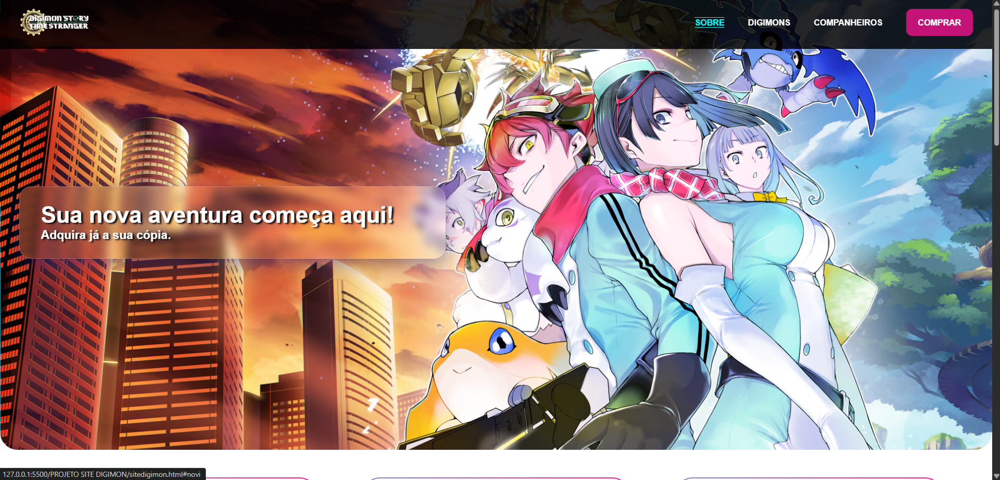
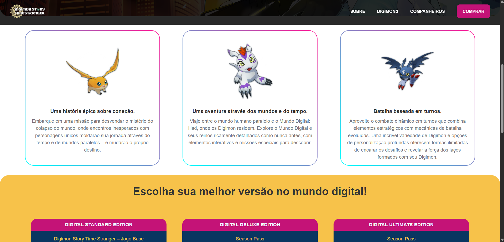
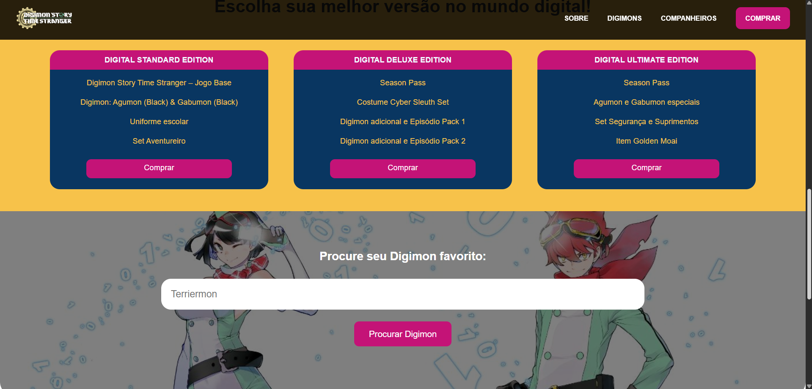
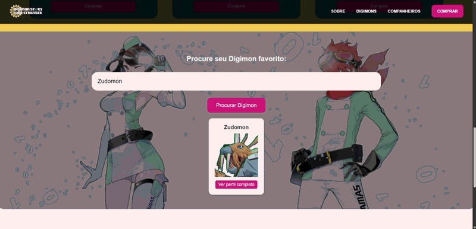

<h1>Digimon Story: Time Stranger – Study Project</h1>

Confira em: <a href="https://regisazevedoo.github.io/Digimon-Time-Stranger/" target="_blank">regisazevedoo.github.io/Digimon-Time-Stranger/</a>

Este projeto nasceu do interesse em explorar a criação de um website temático aproveitando o recente lançamento do novo jogo da franquia. O objetivo principal foi consolidar conhecimentos de front-end, criando uma interface moderna e funcional para apresentar informações sobre o game.

<table border="0">
  <tr>
    <td>
      
    </td>
    <td>
      
    </td>
  </tr>
  <tr>
    <td>
      
    </td>
    <td>
      
    </td>
  </tr>
</table>

 
🚀 Foco do Estudo

Desenvolvimento de um portal web utilizando as seguintes tecnologias:

Estrutura e Semântica: HTML5.

Estilização e Design: CSS3 e Layout Responsivo.

Lógica e Interatividade: Uso de JavaScript para gerar links de perfis e caminhos de imagens em tempo real, evitando a necessidade de um banco de dados estático.

 
⚖️ Governança e Ética

Autorização de Uso: Estabeleci contato direto com a equipe do site Grindosaur para validar a integração de links e ícones.

Acordo de Uso: O projeto foi aprovado para fins Educacionais e de Portfólio, respeitando os termos de serviço da fonte de dados.

Créditos: Todas as imagens e links de perfis são creditados ao Grindosaur.com.
